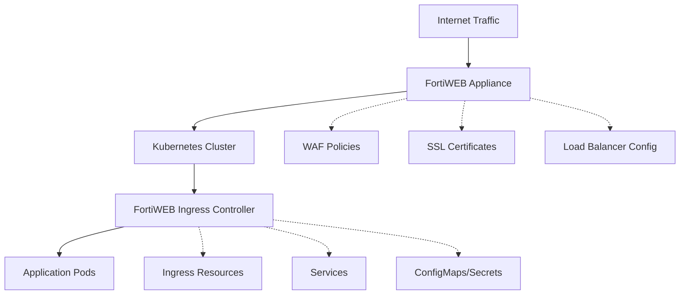

# FortiWEB Ingress Controller

[](https://amerintlxperts.github.io/fortiweb-ingress/)
[](https://kubernetes.io/)
[](https://www.fortinet.com/products/web-application-firewall/fortiweb)

The FortiWEB Ingress Controller enables Kubernetes Ingress resources to integrate with FortiWEB Web Application Firewall appliances. This controller bridges Kubernetes-native ingress definitions with FortiWEB's advanced security features, providing automated web application protection, load balancing, and traffic management.

## Features

- **🛡️ Web Application Protection**: Leverage FortiWEB's comprehensive WAF capabilities including OWASP Top 10 protection, bot mitigation, and DDoS protection
- **⚡ Load Balancing**: Intelligent traffic distribution with health checks and failover
- **🔐 SSL/TLS Management**: Automated certificate handling and SSL offloading
- **🎯 Annotation-Driven**: Fine-grained control through Kubernetes annotations
- **📊 Monitoring Integration**: Built-in logging and metrics for observability
- **🔄 GitOps Ready**: Designed for GitOps workflows with Helm and Flux support

## Quick Start

### Installation

#### Using Helm Repository
```bash
# Add the repository
helm repo add fortiweb-ingress https://amerintlxperts.github.io/fortiweb-ingress/
helm repo update

# Install the controller
helm install fwb-ingress-controller fortiweb-ingress/fwb-k8s-ctrl \
  --namespace kube-system \
  --create-namespace
```

#### Using Local Chart
```bash
# Clone this repository
git clone https://github.com/amerintlxperts/fortiweb-ingress.git
cd fortiweb-ingress

# Install the latest chart version
helm install fwb-ingress-controller ./charts/fwb-k8s-ctrl-2.0.1 \
  --namespace kube-system \
  --create-namespace
```

### Basic Configuration

Create a minimal ingress resource:

```yaml
apiVersion: networking.k8s.io/v1
kind: Ingress
metadata:
  name: my-app-ingress
  annotations:
    fortiweb-ip: "10.1.1.100"                    # FortiWEB appliance IP
    virtual-server-ip: "10.1.2.100"              # Virtual server IP
    server-policy-web-protection-profile: "Inline Standard Protection"
spec:
  ingressClassName: fwb-ingress-controller
  rules:
  - host: myapp.example.com
    http:
      paths:
      - path: /
        pathType: Prefix
        backend:
          service:
            name: my-app-service
            port:
              number: 80
```

## Architecture



### Component Flow
1. **Ingress Controller**: Watches Kubernetes Ingress resources
2. **FortiWEB API**: Controller communicates with FortiWEB via REST API
3. **Virtual Servers**: Creates and manages virtual servers on FortiWEB
4. **Security Policies**: Applies WAF policies and protection profiles
5. **Backend Pools**: Manages application server pools and health checks

## Configuration

### Required Annotations

| Annotation | Description | Example | Required |
|------------|-------------|---------|----------|
| `fortiweb-ip` | FortiWEB appliance IP address | `"10.1.1.100"` | ✅ |
| `fortiweb-login` | Authentication secret reference | `"fwb-credentials"` | ✅ |
| `virtual-server-ip` | Virtual server IP on FortiWEB | `"10.1.2.100"` | ✅ |
| `virtual-server-interface` | FortiWEB network interface | `"port2"` | ✅ |

### Security Policy Annotations

| Annotation | Description | Default |
|------------|-------------|---------|
| `server-policy-web-protection-profile` | WAF protection profile | `"Inline Standard Protection"` |
| `server-policy-https-service` | HTTPS service configuration | `"HTTPS"` |
| `server-policy-http-service` | HTTP service configuration | `"HTTP"` |
| `server-policy-syn-cookie` | SYN cookie protection | `"enable"` |
| `server-policy-http-to-https` | HTTP to HTTPS redirect | `"disable"` |

### Optional Configuration

| Annotation | Description | Default |
|------------|-------------|---------|
| `fortiweb-ctrl-log` | Controller logging level | `"disable"` |
| `virtual-server-addr-type` | IP address type | `"ipv4"` |
| `server-policy-connection-limit` | Connection limits | `""` |
| `server-policy-rate-limit` | Rate limiting rules | `""` |

## Examples

### TLS Termination
```yaml
apiVersion: networking.k8s.io/v1
kind: Ingress
metadata:
  name: tls-ingress
  annotations:
    fortiweb-ip: "10.1.1.100"
    virtual-server-ip: "10.1.2.100"
    server-policy-web-protection-profile: "Inline Standard Protection"
    server-policy-https-service: "HTTPS"
spec:
  ingressClassName: fwb-ingress-controller
  tls:
  - hosts:
    - secure.example.com
    secretName: tls-secret
  rules:
  - host: secure.example.com
    http:
      paths:
      - path: /
        pathType: Prefix
        backend:
          service:
            name: secure-app
            port:
              number: 443
```

### Path-Based Routing
```yaml
apiVersion: networking.k8s.io/v1
kind: Ingress
metadata:
  name: fanout-ingress
  annotations:
    fortiweb-ip: "10.1.1.100"
    virtual-server-ip: "10.1.2.100"
spec:
  ingressClassName: fwb-ingress-controller
  rules:
  - host: example.com
    http:
      paths:
      - path: /api
        pathType: Prefix
        backend:
          service:
            name: api-service
            port:
              number: 8080
      - path: /web
        pathType: Prefix
        backend:
          service:
            name: web-service
            port:
              number: 80
```

More examples available in the [`ingress_examples/`](./ingress_examples/) directory.

## Supported Versions

| Component | Version Range | Notes |
|-----------|---------------|-------|
| Kubernetes | 1.19.8 - 1.31.x | Full compatibility |
| Helm | 3.0+ | Chart API v2 |
| FortiWEB | 6.3+ | REST API required |

### Chart Versions
- **2.0.x**: Current stable release with enhanced security features
- **1.0.x**: Legacy release (maintenance mode)

## Development

### Building and Testing
```bash
# Validate chart syntax
helm lint ./charts/fwb-k8s-ctrl-2.0.1

# Template rendering
helm template test-release ./charts/fwb-k8s-ctrl-2.0.1

# Package chart
helm package ./charts/fwb-k8s-ctrl-2.0.1 -d docs/

# Test installation
helm install test-controller ./charts/fwb-k8s-ctrl-2.0.1 --dry-run
```

### Publishing Updates
```bash
# Automated packaging and publishing
./doit.sh

# Manual process:
helm package ./charts/fwb-k8s-ctrl-2.0.1 -d docs/
helm repo index docs/ --url https://amerintlxperts.github.io/fortiweb-ingress/
git checkout gh-pages
git add docs/
git commit -m "Update Helm charts"
git push origin gh-pages
```

## Troubleshooting

### Common Issues

#### Controller Not Starting
```bash
# Check pod status
kubectl get pods -n kube-system -l app.kubernetes.io/name=fwb-k8s-ctrl

# Check logs
kubectl logs -n kube-system deployment/fwb-ingress-controller

# Verify RBAC permissions
kubectl auth can-i get ingresses --as=system:serviceaccount:kube-system:fortiweb-ingress
```

#### FortiWEB Connection Issues
```bash
# Test connectivity from pod
kubectl exec -n kube-system deployment/fwb-ingress-controller -- \
  curl -k https://<fortiweb-ip>/api/v2.0/cmdb/system/status

# Check authentication secret
kubectl get secret <fortiweb-login> -o yaml
```

#### Ingress Not Working
```bash
# Validate ingress resource
kubectl describe ingress <ingress-name>

# Check service endpoints
kubectl get endpoints <service-name>

# Verify FortiWEB virtual server
# (Check FortiWEB GUI or CLI for virtual server configuration)
```

### Debug Mode
Enable debug logging by setting the controller log level:
```yaml
annotations:
  fortiweb-ctrl-log: "enable"
```

## Security Considerations

- **Credentials Management**: Store FortiWEB authentication credentials in Kubernetes secrets
- **Network Segmentation**: Ensure proper network connectivity between cluster and FortiWEB
- **RBAC**: Use minimal required permissions for the controller service account
- **TLS**: Enable TLS communication between controller and FortiWEB when possible

## Contributing

1. Fork the repository
2. Create a feature branch: `git checkout -b feature/new-feature`
3. Make changes and test thoroughly
4. Update documentation and examples
5. Submit a pull request

## Support

- **Documentation**: [Official FortiWEB Ingress Controller Guide](https://docs.fortinet.com/document/fortiweb/latest/ingress-controller-installation-guide/742835/fortiweb-ingress-controller-overview)
- **Issues**: [GitHub Issues](https://github.com/amerintlxperts/fortiweb-ingress/issues)
- **Community**: [Fortinet Developer Network](https://fndn.fortinet.net/)

## License

This project is licensed under the [Apache License 2.0](LICENSE).

---

**Note**: This controller requires a FortiWEB appliance with REST API access. Ensure your FortiWEB firmware version supports the required API endpoints.
